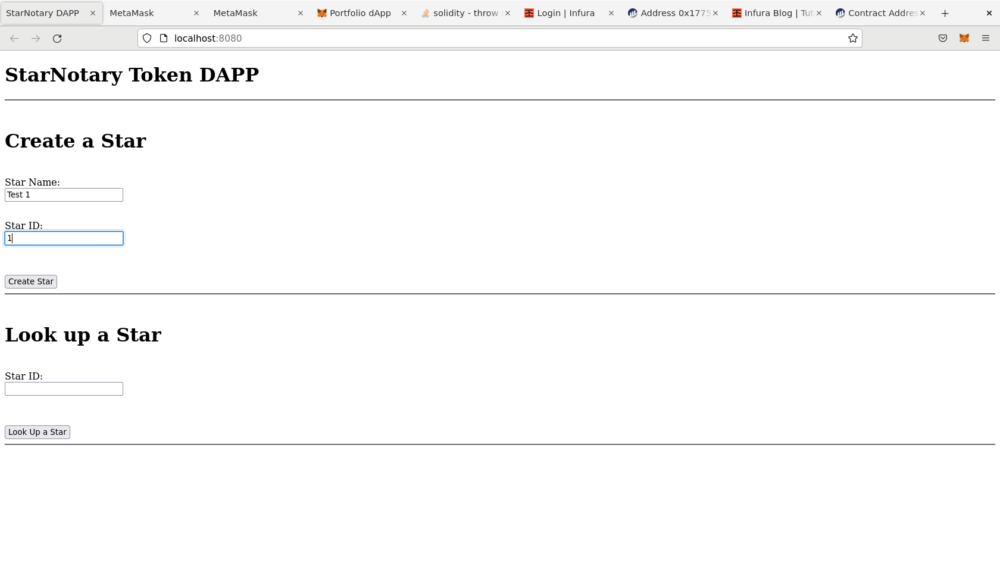
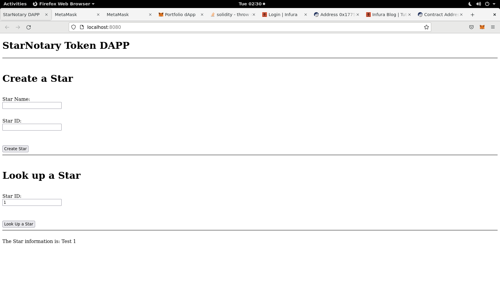

# ND1309 C2 Ethereum Smart Contracts, Tokens and Dapps - Project Starter 
**PROJECT: Decentralized Star Notary Service Project** - For this project, you will create a DApp by adding functionality with your smart contract and deploy it on the public testnet.

## Submission Details

### ERC-721 Token Name

David Star Notary

### ERC-721 Token Symbol

DSN

### Truffle Version

Truffle v5.6.0 (core: 5.6.0)

### OpenZeppelin Version

openzeppelin-solidity-2.3.0


### Token Address on the ~~Rinkeby~~ Goerli Network


Note: As of October 5, Infrura depracted Rinkeby Network 
see https://blog.infura.io/post/deprecation-timeline-for-rinkeby-ropsten-and-kovan-testnets

Therefore the contract was deployed to the Goerli public network instead as advised by the infura blog.

contract https://goerli.etherscan.io/address/0x141e46c67d535e323ffe514b67171555478f37b2


### Dependencies 

```
~$ truffle -v
Truffle v5.6.0 (core: 5.6.0)
Ganache v7.4.3
Solidity v0.5.16 (solc-js)
Node v14.20.0
Web3.js v1.7.4
```

### Screenshots

Create A Start



Lookup a Star



Lookup invalid Star

